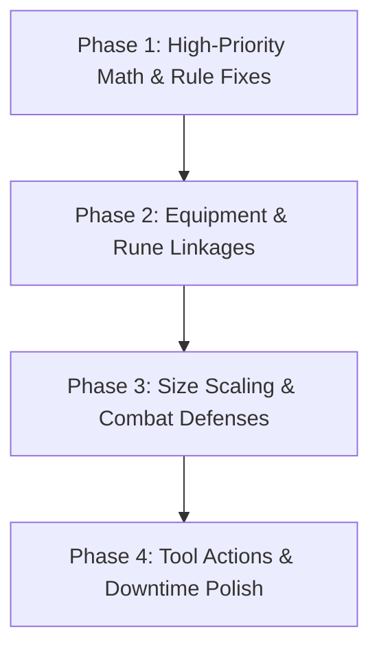

# Domain and Rules Discrepancy Remediation Plan

> **Archived.** Historical record of the 2026-09-27 rules audit; every item landed on 2026-09-29. Code references point at files, not lines, because line numbers drift.

This plan outlines the sequential, phase-by-phase resolution of all verified rules and domain accuracy discrepancies in Pathfinder 1st Edition and Pathfinder 2nd Edition.

**Status:** 100% Completed (All Phases 1–4 Landed & Verified with 798 Tests Passing)

---

## Plan Structure Overview



Each phase consists of isolated, test-driven changes. Every task specifies:
- Target files
- Expected behavior vs current implementation
- Unit tests to be added or updated
- Validation criteria

---

## Phase 1: High-Priority Math & Rule Fixes

### Task 1.1 — PF1e: Tiny or Smaller CMB Dexterity Substitution
- **Target:** [`app/src/systems/pf1e/engine/compute.ts`](../../app/src/systems/pf1e/engine/compute.ts)
- **Rule:** CRB p. 199 (*Combat Maneuvers*): Creatures that are size Tiny, Diminutive, or Fine substitute Dexterity modifier for Strength modifier when calculating CMB.
- **Change:**
  ```typescript
  const cmbAbilityMod = ['tiny', 'diminutive', 'fine'].includes(size) ? mods.dex : mods.str
  // cmb: bab + cmbAbilityMod + sizeCmb + character.combat.cmbMisc
  ```
- **Tests:** Add test in [`compute.test.ts`](../../app/src/systems/pf1e/engine/compute.test.ts) verifying a Tiny character with Str 6 (-2) and Dex 16 (+3) uses +3 for CMB.
- **Exit Criteria:** `npx vitest run src/systems/pf1e/engine/compute.test.ts` passes.

---

### Task 1.2 — PF1e: Trained-Only Skills Completeness
- **Target:** [`app/src/systems/pf1e/engine/vitals.ts`](../../app/src/systems/pf1e/engine/vitals.ts)
- **Rule:** CRB Table 4-1: Sleight of Hand, Spellcraft, Linguistics, and Profession cannot be used untrained.
- **Change:** Update `UNTRAINED_UNUSABLE_SKILLS`:
  ```typescript
  export const UNTRAINED_UNUSABLE_SKILLS = new Set([
    'disable-device',
    'handle-animal',
    'use-magic-device',
    'sleight-of-hand',
    'spellcraft',
    'linguistics',
    'profession',
  ])
  ```
- **Tests:** Update [`compute.test.ts`](../../app/src/systems/pf1e/engine/compute.test.ts) asserting `view.skillTotals['spellcraft'] === null` and `view.skillTotals['sleight-of-hand'] === null` when ranks = 0.
- **Exit Criteria:** `npx vitest run src/systems/pf1e` passes.

---

### Task 1.3 — PF2e: Attack Helper Agile Trait Detection
- **Target:** [`app/src/systems/pf2e/sidebar/pf2eAttackHelper.ts`](../../app/src/systems/pf2e/sidebar/pf2eAttackHelper.ts)
- **Rule:** Player Core p. 282: Weapons with the `agile` trait take -4 / -8 MAP instead of -5 / -10.
- **Change:** In `isAgileStrike(strike, character)`:
  ```typescript
  (strike.traits ?? []).some((t) => t.toLowerCase() === 'agile') || ...
  ```
- **Tests:** Add test in [`pf2eAttackHelper.test.ts`](../../app/src/systems/pf2e/sidebar/pf2eAttackHelper.test.ts) with a strike having `traits: ['agile']` and a non-agile name.
- **Exit Criteria:** `npx vitest run src/systems/pf2e/sidebar` passes.

---

### Task 1.4 — PF1e: Paladin & Ranger Caster Level Progression
- **Target:** [`app/src/systems/pf1e/engine/spellcasting.ts`](../../app/src/systems/pf1e/engine/spellcasting.ts)
- **Rule:** CRB p. 60 & 66: Paladins and Rangers have no caster level until 4th level, and at 4th level and higher, CL = `class level - 3`.
- **Change:** In `casterLevelForEntry(entry, classes)`:
  ```typescript
  if (entry.classRowId) {
    const row = classes.find((cls) => cls.id === entry.classRowId)
    const levels = row?.levels ?? 0
    const classId = row?.class?.id?.toLowerCase()
    if (classId === 'class.paladin' || classId === 'class.ranger') {
      return Math.max(0, levels - 3)
    }
    return levels
  }
  ```
- **Tests:** Add tests in [`compute.test.ts`](../../app/src/systems/pf1e/engine/compute.test.ts) verifying Paladin 3 (CL 0), Paladin 4 (CL 1), Ranger 5 (CL 2).
- **Exit Criteria:** `npx vitest run src/systems/pf1e` passes.

---

## Phase 2: Equipment & Rune Linkages

### Task 2.1 — PF2e: Weapon Potency & Striking Runes Wired to Strikes
- **Target:** [`app/src/systems/pf2e/engine/strikes.ts`](../../app/src/systems/pf2e/engine/strikes.ts)
- **Rule:** Player Core p. 280: Potency runes grant +1, +2, or +3 item bonus to attack rolls. Striking runes increase weapon damage dice (striking: 2 dice, greater: 3 dice, major: 4 dice).
- **Change:**
  1. In `strikeAttack`: Retrieve `linked = findItem(character.inventory.items, strike.itemId)`. If `linked?.weapon?.potencyRune`, include it in the item bonuses passed to `stackBreakdown`.
  2. In `strikeDamage`: If `linked?.weapon?.strikingRune`, adjust base dice count (e.g. `1d8` -> `2d8` for `striking`).
- **Tests:** Add unit tests in [`compute.test.ts`](../../app/src/systems/pf2e/engine/compute.test.ts) for weapons with potency and striking runes.
- **Exit Criteria:** `npx vitest run src/systems/pf2e` passes.

---

### Task 2.2 — PF2e: Armor Resilient Runes Wired to Saving Throws
- **Target:** [`app/src/systems/pf2e/engine/compute.ts`](../../app/src/systems/pf2e/engine/compute.ts)
- **Rule:** Player Core p. 281: Resilient runes etched on armor grant +1, +2, or +3 item bonus to Fortitude, Reflex, and Will saving throws.
- **Change:** Check `equippedArmor(character)?.armor?.resilientRune`:
  ```typescript
  const resilientBonus =
    resilient === 'majorResilient' ? 3 :
    resilient === 'greaterResilient' ? 2 :
    resilient === 'resilient' ? 1 : 0
  ```
  Pass `resilientBonus` as extra item modifier into `fortitude`, `reflex`, and `will`.
- **Tests:** Add tests in [`compute.test.ts`](../../app/src/systems/pf2e/engine/compute.test.ts).
- **Exit Criteria:** `npx vitest run src/systems/pf2e` passes.

---

### Task 2.3 — PF1e: Flat-Footed CMD in Derived View
- **Target:** [`app/src/systems/pf1e/engine/types.ts`](../../app/src/systems/pf1e/engine/types.ts) & [`app/src/systems/pf1e/engine/compute.ts`](../../app/src/systems/pf1e/engine/compute.ts)
- **Rule:** CRB p. 199: Flat-footed creatures do not add Dexterity bonus or Dodge bonuses to CMD (Dex penalties still apply).
- **Change:**
  ```typescript
  flatFootedCmd:
    10 +
    bab +
    mods.str +
    Math.min(0, mods.dex) +
    sizeCmb +
    character.armorClass.deflection +
    character.combat.cmdMisc
  ```
  Expose `flatFootedCmd` in `DerivedView` and display in [`CombatPanel.tsx`](../../app/src/systems/pf1e/sheet/CombatPanel.tsx).
- **Tests:** Assert `flatFootedCmd` in [`compute.test.ts`](../../app/src/systems/pf1e/engine/compute.test.ts).
- **Exit Criteria:** `npx vitest run src/systems/pf1e` passes.

---

## Phase 3: Size Scaling & Combat Defenses

### Task 3.1 — PF2e: Creature Size Multipliers for Bulk Capacity
- **Target:** [`app/src/systems/pf2e/engine/bulk.ts`](../../app/src/systems/pf2e/engine/bulk.ts) & [`compute.ts`](../../app/src/systems/pf2e/engine/compute.ts)
- **Rule:** Player Core p. 272: Large creatures have double bulk limits; Tiny creatures have half bulk limits.
- **Change:** Pass `character.identity.size` into `bulkCapacityTenths` and `bulkMaximumTenths`.
- **Tests:** Add tests in [`compute.test.ts`](../../app/src/systems/pf2e/engine/compute.test.ts) for Tiny, Medium, and Large creatures.
- **Exit Criteria:** `npx vitest run src/systems/pf2e` passes.

---

### Task 3.2 — PF1e: Quadruped Carrying Capacity Support
- **Target:** [`app/src/systems/pf1e/engine/abilities.ts`](../../app/src/systems/pf1e/engine/abilities.ts) & [`encumbrance.ts`](../../app/src/systems/pf1e/engine/encumbrance.ts)
- **Rule:** CRB Table 7-5: Medium quadrupeds have ×1.5 multiplier; Large quadrupeds have ×3 multiplier.
- **Change:** Add optional `isQuadruped?: boolean` to `sizeCarryMultiplier(size, isQuadruped)`.
- **Tests:** Unit tests verifying quadruped vs biped load thresholds.
- **Exit Criteria:** `npx vitest run src/systems/pf1e` passes.

---

### Task 3.3 — PF1e: Swim Skill Double Armor Check Penalty
- **Target:** [`app/src/systems/pf1e/engine/vitals.ts`](../../app/src/systems/pf1e/engine/vitals.ts)
- **Rule:** CRB p. 107: Swim checks take double normal armor check penalty.
- **Change:** If skill key is `'swim'`, double the applied ACP in `skillTotal`.
- **Tests:** Unit test in [`compute.test.ts`](../../app/src/systems/pf1e/engine/compute.test.ts) asserting Swim check with -3 ACP takes -6 total.
- **Exit Criteria:** `npx vitest run src/systems/pf1e` passes.

---

### Task 3.4 — PF2e: Derived Dying Threshold
- **Target:** [`app/src/systems/pf2e/engine/compute.ts`](../../app/src/systems/pf2e/engine/compute.ts) & [`types.ts`](../../app/src/systems/pf2e/engine/types.ts)
- **Rule:** Player Core p. 411: Character dies at Dying 4 - Doomed value.
- **Change:** Add `maxDying: Math.max(1, 4 - (character.vitals.doomed ?? 0))` to `DerivedView`.
- **Tests:** Unit test in [`compute.test.ts`](../../app/src/systems/pf2e/engine/compute.test.ts).
- **Exit Criteria:** `npx vitest run src/systems/pf2e` passes.

---

## Phase 4: Combat Tools & Downtime Polish

### Task 4.1 — PF1e: Actions List 5-Foot Step & Sheathe AoO Warning
- **Target:** [`app/src/systems/pf1e/sidebar/pf1eActionsList.ts`](../../app/src/systems/pf1e/sidebar/pf1eActionsList.ts)
- **Rule:** CRB Table 8-2: 5-foot step is a non-provoking 5 ft move when no other movement is made; sheathing provokes an AoO while drawing does not.
- **Change:**
  1. Add `free-5ft-step` to Free Actions list.
  2. Split `move-draw-weapon` and `move-sheathe-weapon`, noting "Provokes AoO" on sheathe.
- **Tests:** Update [`pf1eActionsList.test.ts`](../../app/src/systems/pf1e/sidebar/pf1eActionsList.test.ts).
- **Exit Criteria:** `npx vitest run src/systems/pf1e/sidebar` passes.

---

### Task 4.2 — PF2e: Actions List Grabbed Manipulate Target
- **Target:** [`app/src/systems/pf2e/sidebar/pf2eActionsList.ts`](../../app/src/systems/pf2e/sidebar/pf2eActionsList.ts)
- **Rule:** Player Core p. 443: Grabbed condition imposes DC 5 flat check on manipulate actions, not on standard strikes.
- **Change:** Apply the DC 5 flat check warning to `kind === 'spell'` and actions with manipulate, removing it from simple attacks.
- **Tests:** Update [`pf2eActionsList.test.ts`](../../app/src/systems/pf2e/sidebar/pf2eActionsList.test.ts).
- **Exit Criteria:** `npx vitest run src/systems/pf2e/sidebar` passes.

---

### Task 4.3 — PF2e: Budget Calculator Downtime (Remaster 2-day)
- **Target:** [`app/src/systems/pf2e/sidebar/pf2eBudgetCalculator.ts`](../../app/src/systems/pf2e/sidebar/pf2eBudgetCalculator.ts)
- **Rule:** Player Core p. 244: Remaster downtime baseline is 2 days per formula.
- **Change:** Update base days to 2 per item batch.
- **Tests:** Update [`pf2eBudgetCalculator.test.ts`](../../app/src/systems/pf2e/sidebar/pf2eBudgetCalculator.test.ts).
- **Exit Criteria:** `npx vitest run src/systems/pf2e/sidebar` passes.

---

### Task 4.4 — Documentation & Final Sync
- **Targets:**
  - [`docs/pf1e-character-sheet-design.md`](../pf1e-character-sheet-design.md)
  - [`docs/user-guide.md`](../user-guide.md)
  - [`docs/domain-and-rules-discrepancies.md`](domain-and-rules-discrepancies.md)
- **Changes:** Note Synthesist suit design decision, condition engine boundary, and mark resolved items in discrepancy report.
- **Exit Criteria:** Full suite passes (`npm test -- --run && npm run lint`).
